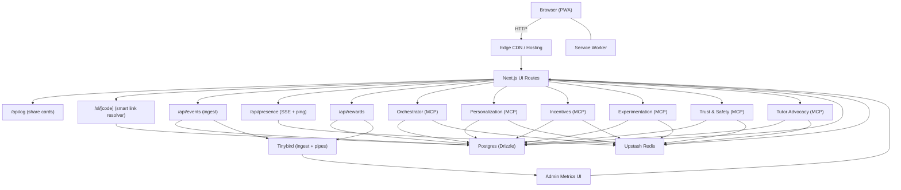

```mermaid
flowchart TD
  U["Browser (PWA)"]
  SW["Service Worker"]
  CDN["Edge CDN / Hosting"]
  UI["Next.js UI Routes"]
  API_OG["/api/og (share cards)"]
  API_SL["/sl/[code] (smart link resolver)"]
  API_EVENTS["/api/events (ingest)"]
  API_PRES["/api/presence (SSE + ping)"]
  API_REW["/api/rewards"]
  ORCH["Orchestrator (MCP)"]
  PERS["Personalization (MCP)"]
  INC["Incentives (MCP)"]
  EXP["Experimentation (MCP)"]
  SAFE["Trust & Safety (MCP)"]
  TADV["Tutor Advocacy (MCP)"]
  PG["Postgres (Drizzle)"]
  R["Upstash Redis"]
  TB["Tinybird (ingest + pipes)"]
  DASH["Admin Metrics UI"]

  U -->|HTTP| CDN --> UI
  U --- SW
  UI --> API_OG
  UI --> API_SL
  UI --> API_EVENTS
  UI --> API_PRES
  UI --> API_REW

  UI --> ORCH
  UI --> PERS
  UI --> INC
  UI --> EXP
  UI --> SAFE
  UI --> TADV

  API_PRES --> R
  API_SL --> PG
  API_EVENTS --> PG
  API_EVENTS --> TB
  API_REW --> PG
  API_REW --> TB

  UI --> PG
  UI --> R
  ORCH --> PG
  PERS --> PG
  INC --> PG
  EXP --> PG
  SAFE --> PG
  TADV --> PG
  ORCH --> R
  PERS --> R
  INC --> R
  EXP --> R
  SAFE --> R
  TADV --> R

  TB --> DASH
  DASH --> UI
```
