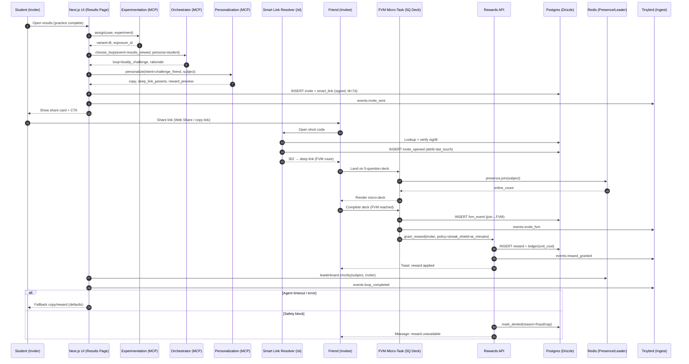

```mermaid
sequenceDiagram
  autonumber
  participant U as Student (Inviter)
  participant UI as Next.js UI (Results Page)
  participant EXP as Experimentation (MCP)
  participant ORCH as Orchestrator (MCP)
  participant PERS as Personalization (MCP)
  participant SL as Smart Link Resolver (/sl)
  participant N as Friend (Invitee)
  participant FVM as FVM Micro-Task (5Q Deck)
  participant REW as Rewards API
  participant PG as Postgres (Drizzle)
  participant R as Redis (Presence/Leader)
  participant TB as Tinybird (Ingest)

  U->>UI: Open results (practice complete)
  UI->>EXP: assign(user, experiment)
  EXP-->>UI: variant=B, exposure_id
  UI->>ORCH: choose_loop(event=results_viewed, persona=student)
  ORCH-->>UI: loop=buddy_challenge, rationale

  UI->>PERS: personalize(intent=challenge_friend, subject)
  PERS-->>UI: copy, deep_link_params, reward_preview

  UI->>PG: INSERT invite + smart_link (signed, ttl=7d)
  UI->>TB: events.invite_sent
  UI-->>U: Show share card + CTA

  U->>N: Share link (Web Share / copy link)
  N->>SL: Open short code
  SL->>PG: Lookup + verify sig/ttl
  SL->>PG: INSERT invite_opened (attrib last_touch)
  SL-->>N: 302 → deep link (FVM route)

  N->>FVM: Land on 5-question deck
  FVM->>R: presence.join(subject)
  R-->>FVM: online_count
  FVM-->>N: Render micro-deck

  N->>FVM: Complete deck (FVM reached)
  FVM->>PG: INSERT fvm_event (join→FVM)
  FVM->>TB: events.invite_fvm

  FVM->>REW: grant_reward(inviter, policy=streak_shield+ai_minutes)
  REW->>PG: INSERT reward + ledger(unit_cost)
  REW->>TB: events.reward_granted
  REW-->>N: Toast: reward applied

  UI->>R: leaderboard.zincrby(subject, inviter)
  UI->>TB: events.loop_completed

  alt Agent timeout / error
    UI-->>U: Fallback copy/reward (defaults)
  else Safety block
    REW->>PG: mark_denied(reason=fraud/cap)
    REW-->>N: Message: reward unavailable
  end
```
